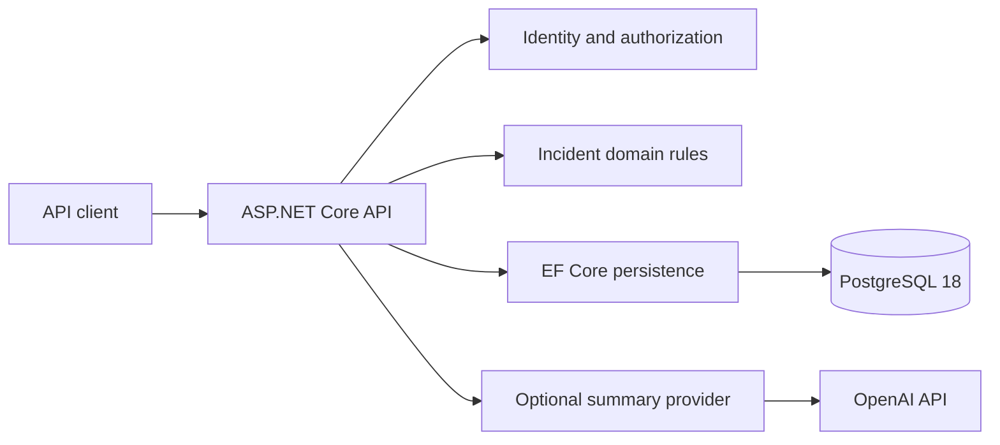
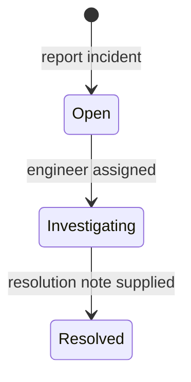

# Architecture and decisions

IncidentDesk is a modular monolith: one HTTP service and one PostgreSQL database. Separate microservices, queues and repository abstractions would add operational complexity without improving this first version's incident workflow.

## Project boundaries

`IncidentDesk.Domain` owns incident state transitions, validation and version changes. It has no HTTP or EF Core dependencies, so its rules can be tested without a server or database.

`IncidentDesk.Api` owns request contracts, authentication/authorization, persistence, exception responses and provider integration. Feature folders keep related controllers and contracts together. EF Core is already a unit-of-work abstraction; the application uses its `DbContext` directly instead of wrapping it in a generic repository.

The unit-test project verifies domain rules and the OpenAI adapter's request/response contract using an in-memory HTTP handler. The integration-test project hosts the real ASP.NET Core application with `WebApplicationFactory`, uses a disposable PostgreSQL 18 Testcontainer, applies committed migrations and exercises HTTP/database behavior. Its Data Protection keys are ephemeral and stay inside the test fixture. The LLM boundary is replaced in tests so tests are deterministic and never incur provider charges.

## Data model

- **Users** are ASP.NET Core Identity users with a display name and Reporter or Engineer role.
- **Incidents** contain the reporter and optional engineer assignment, title, description, severity, lifecycle timestamps, resolution note, reviewed summary and an explicit concurrency version.
- **Comments** are attributed, append-only investigation notes belonging to an incident.
- **Status history** records the initial Open state and subsequent transitions, including the actor, previous/next states, timestamp and resolution note where applicable.

Foreign keys enforce relationships. Requests do not accept arbitrary actor IDs, reviewer IDs or timestamps: those come from the authenticated principal and server clock. Indexes support queue filtering and chronological child-record reads. The first version uses bounded, parameterized substring search; it does not claim full-text search or cursor-pagination performance at large scale.

## Workflow invariants

The domain rejects skipped, reversed and repeated transitions. Investigation requires a valid engineer assignment. Resolved incident core fields and assignment cannot change. Comments and reviewed summaries remain writable after resolution so an engineer can document follow-up information without silently reopening an incident.

Reporter access is enforced when selecting incidents, including searches and related comments/history. Engineers can manage the shared queue. Notes have one visibility level and are visible to the reporter; the system does not pretend to support confidential internal notes.

## Preventing lost updates

Every incident has a UUID version configured as an EF concurrency token. Reads expose that version as a strong quoted ETag. An existing-incident write must present the version it was based on in `If-Match`.

The application validates that precondition and advances the version for a successful mutation. EF also includes the original version in its database update predicate. That second check closes the race where two requests both pass the initial comparison before either saves. If another writer wins, the losing update raises an EF concurrency exception and returns `412`.

Changes to an incident and their new history/comment records are saved in one database transaction. A failed precondition or database concurrency conflict does not leave behind a status-history row or a comment. Comment creation also advances the incident version: a draft summary based on earlier investigation notes must not accidentally overwrite a summary after new evidence arrived.

## Authentication

ASP.NET Core Identity handles password hashing, lockout and bearer-token protection. Clients receive opaque access and refresh tokens. The application persists Data Protection keys so ordinary container replacement does not invalidate existing tokens. Local demonstration accounts are seeded only by an explicit development command; the API has no public registration route.

This is deliberately narrower than an enterprise authentication system. There is no SSO, public account lifecycle, session-management UI or per-token revocation service. A production integration should replace or adapt the local identity boundary to the organization's provider.

## AI is an optional read operation

The summary provider receives an authorized incident snapshot and its investigation notes, read consistently under a repeatable-read database transaction. The transaction ends before the external request. Generation returns draft text together with the snapshot's UUID `sourceVersion` and ETag; it does not save text, mutate state, assign engineers or resolve incidents. The model cannot invoke tools or run incident-management operations.

Only a separate engineer-authenticated save writes the reviewed summary, reviewer and review timestamp. That save uses the normal incident concurrency precondition. Provider errors, timeouts or a missing API key leave core behavior available. Automated tests exercise this boundary using a fake provider, never the public model endpoint.

## Operational behavior

The application exposes separate liveness and database-readiness endpoints. Readiness fails with `503` if PostgreSQL is unreachable or migrations remain unapplied. Exceptions map to consistent Problem Details responses without exposing database details or provider response bodies to clients. Request trace IDs allow failures to be correlated with server logs.

Schema changes are checked-in EF migrations. A dedicated `--migrate` invocation applies them and exits. Ordinary API startup does not change schema. Compose models the required sequence explicitly: healthy PostgreSQL, successful migration/seed job, then the API. Deployment can run the same migration command separately before starting new application instances.

Future work can add a React client, Azure hosting, managed identity, notifications or richer search after there is an actual need. None is required to demonstrate and test the .NET backend workflow.
